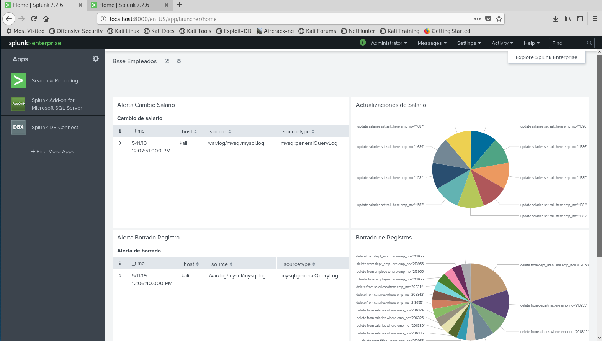
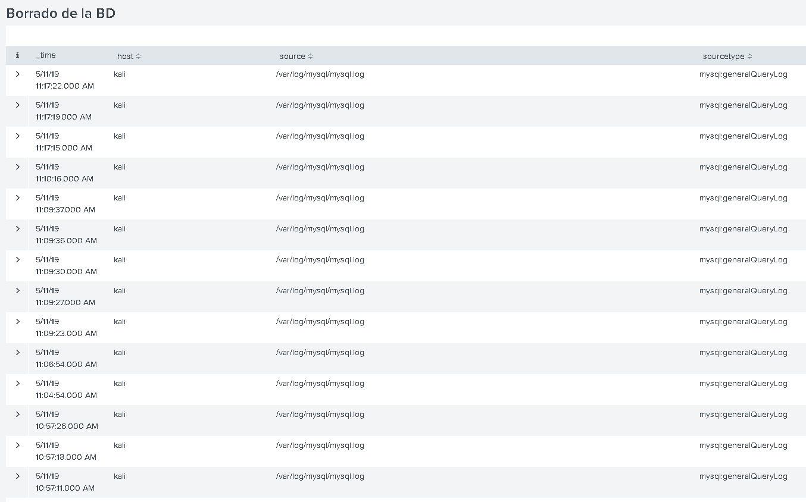
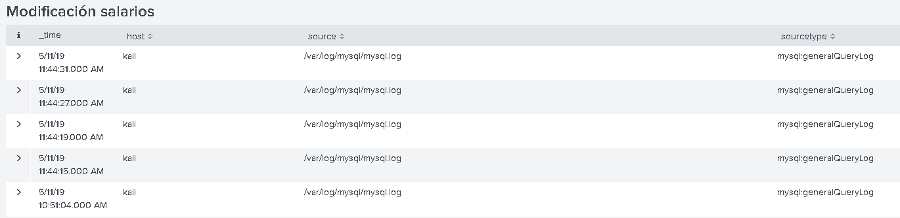
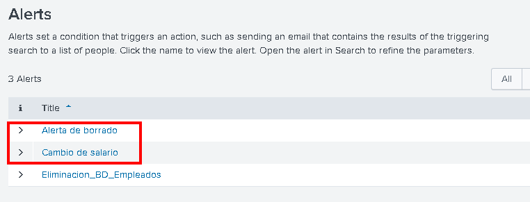
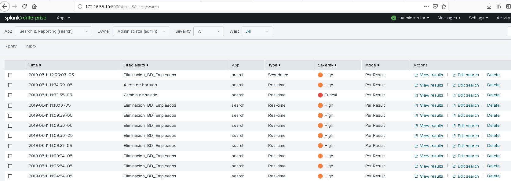

# TALLER 4

## TUTORIAL

Las siguientes imagenes presentan los resultados de la ejecución del tutorial:

## IMPLENTACIÓN CONTROL DE DETECCIÓN

A continuació, se presentan los resultados de la implementación de Splunk usando la base de datos MySQL.

Los dos riesgos establecidos son:

1.	Riesgo 1: Eliminación de registros de forma no autorizada sobre las tablas de la base de datos de empleados “employees”, debido a la sensibilidad e importancia de esta  información para la compañía.

2.	Riesgo 2: Modificación del campo  “salary” en la tabla “salaries” de la base de datos “employees”, ya que puede generar pérdidas económicas a la compañía.

Se presenta las reglas implementadas para monitorear los eventos de riesgo desde el Dashboard:

A continuación se presenta el detalle de datos de las alertas:

Adicionalmente, se presenta la configuración de alertas realizada para el borrado en la base de datos y la modificación de salarios:

